# [NYC Green Taxi](https://github.com/kthouz/NYC_Green_Taxi)#

This [repo](https://github.com/kthouz/NYC_Green_Taxi) contains submissions files to the Capital One data science challenge.

## Contents of the repo ##

1. [The report](https://github.com/kthouz/NYC_Green_Taxi/blob/master/README.md) in .md format in the subdir /NYC Green Taxi/NYC Green Taxi.md
2. NYC Green Taxi ipython notebook [NYC Green Taxi.ipynb](https://github.com/kthouz/NYC_Green_Taxi/blob/master/NYC%20Green%20Taxi.ipynb)
3. The script to run predictions [tip_predictor.py](https://github.com/kthouz/NYC_Green_Taxi/blob/master/tip_predictor.py)
4. The pickle of my classifier model [my_classifier.pkl](https://github.com/kthouz/NYC_Green_Taxi/blob/master/my_classifier.pkl)
5. The pickle of my regression model [my_regressor.pkl](https://bitbucket.org/cgirabawe/nyc-taxi/src/18fcf8b4aef4dd7f3fb6b834e36eaff92f5908db/my_regressor.pkl?at=master&fileviewer=file-view-default)
6. A notebook example of how use tip_predictor.py to make predictions [test.ipynb](https://github.com/kthouz/NYC_Green_Taxi/blob/master/test.ipynb)
7. A [csv](https://github.com/kthouz/NYC_Green_Taxi/blob/master/submission.csv) of predictions made on the 2015 September dataset. This has two columns. First if transaction index, second is the predicted percentage tip


**Note:** This entire [repo](https://bitbucket.org/cgirabawe/nyc-taxi/src/da1c7b92f02cb82a432d78c44abcea0e014f141b?at=master) is also available on my bitbucket

```python
import pandas as pd
import numpy as np
import datetime as dt
import matplotlib.pyplot as plt
import os, json, requests, pickle
from scipy.stats import skew
from shapely.geometry import Point,Polygon,MultiPoint,MultiPolygon
from scipy.stats import ttest_ind, f_oneway, lognorm, levy, skew, chisquare
#import scipy.stats as st
from sklearn.preprocessing import normalize, scale
from tabulate import tabulate #pretty print of tables. source: http://txt.arboreus.com/2013/03/13/pretty-print-tables-in-python.html
from shapely.geometry import Point,Polygon,MultiPoint
%matplotlib inline

import warnings
warnings.filterwarnings('ignore')
```
# Analysis

In this notebook, I will explore data on New York City Green Taxi of [september 2015](http://www.nyc.gov/html/tlc/html/about/trip_record_data.shtml). I will start with some warm up questions about the dataset. Later, I will build a model to predict the percentage tip a driver would exepect on each trip. The code is fully written in python with few additional open-source libraries easy to install. 
- [shapely](https://pypi.python.org/pypi/Shapely)
- [scikit learn](http://scikit-learn.org/stable/)
- [tabulate](http://txt.arboreus.com/2013/03/13/pretty-print-tables-in-python.html)

In this analysis, some notion of statistics and hypothesis test are used but are very easy to follow. This [handbook of statistics](http://www.biostathandbook.com/index.html) can be used as a reference to explain basics.

## Warm up


***Let's first download the dataset and print out the its size***


```python
# Download the September 2015 dataset
if os.path.exists('data_september_2015.csv'): # Check if the dataset is present on local disk and load it
    data = pd.read_csv('data_september_2015.csv')
else: # Download dataset if not available on disk
    url = "https://s3.amazonaws.com/nyc-tlc/trip+data/green_tripdata_2015-09.csv"
    data = pd.read_csv(url)
    data.to_csv(url.split('/')[-1])

# Print the size of the dataset
print "Number of rows:", data.shape[0]
print "Number of columns: ", data.shape[1]
```

    Number of rows: 1494926
    Number of columns:  21


***Let's have a look at the distribution of trip distance***


```python
# define the figure with 2 subplots
fig,ax = plt.subplots(1,2,figsize = (15,4)) 

# histogram of the number of trip distance
data.Trip_distance.hist(bins=30,ax=ax[0])
ax[0].set_xlabel('Trip Distance (miles)')
ax[0].set_ylabel('Count')
ax[0].set_yscale('log')
ax[0].set_title('Histogram of Trip Distance with outliers included')

# create a vector to contain Trip Distance
v = data.Trip_distance 
# exclude any data point located further than 3 standard deviations of the median point and 
# plot the histogram with 30 bins
v[~((v-v.median()).abs()>3*v.std())].hist(bins=30,ax=ax[1]) # 
ax[1].set_xlabel('Trip Distance (miles)')
ax[1].set_ylabel('Count')
ax[1].set_title('A. Histogram of Trip Distance (without outliers)')

# apply a lognormal fit. Use the mean of trip distance as the scale parameter
scatter,loc,mean = lognorm.fit(data.Trip_distance.values,
                               scale=data.Trip_distance.mean(),
                               loc=0)
pdf_fitted = lognorm.pdf(np.arange(0,12,.1),scatter,loc,mean)
ax[1].plot(np.arange(0,12,.1),600000*pdf_fitted,'r') 
ax[1].legend(['data','lognormal fit'])

# export the figure
plt.savefig('Question2.jpeg',format='jpeg')
plt.show()

```


The Trip Distance is asymmetrically distributed. It is skewed to the right and it has a median smaller than its mean and both smaller than the standard deviation. The skewness is due to the fact that the variable has a lower boundary of 0. The distance can't be negative. [**This distribution has a structure of a lognormal distribution**](http://www.itl.nist.gov/div898/handbook/eda/section3/eda3669.htm). To the left is plotted the distribution of the entire raw set of Trip distance. To the right, outliers have been removed before plotting. *Outliers are defined as any point located further than 3 standard deviations from the mean*

**The hypothesis:** The trips are not random. If there were random, we would have a (symmetric) Gaussian distribution. The non-zero autocorrelation may be related the fact that people taking ride are pushed by a common cause, for instance, people rushing to work.

***Let's see if the time of the day has any impact on the trip distance***


```python
# First, convert pickup and drop off datetime variable in their specific righ format
data['Pickup_dt'] = data.lpep_pickup_datetime.apply(lambda x:dt.datetime.strptime(x,"%Y-%m-%d %H:%M:%S"))
data['Dropoff_dt'] = data.Lpep_dropoff_datetime.apply(lambda x:dt.datetime.strptime(x,"%Y-%m-%d %H:%M:%S"))

# Second, create a variable for pickup hours
data['Pickup_hour'] = data.Pickup_dt.apply(lambda x:x.hour)

# Mean and Median of trip distance by pickup hour
# I will generate the table but also generate a plot for a better visualization

fig,ax = plt.subplots(1,1,figsize=(9,5)) # prepare fig to plot mean and median values
# use a pivot table to aggregate Trip_distance by hour
table1 = data.pivot_table(index='Pickup_hour', values='Trip_distance',aggfunc=('mean','median')).reset_index()
# rename columns
table1.columns = ['Hour','Mean_distance','Median_distance']
table1[['Mean_distance','Median_distance']].plot(ax=ax)
plt.ylabel('Metric (miles)')
plt.xlabel('Hours after midnight')
plt.title('Distribution of trip distance by pickup hour')
#plt.xticks(np.arange(0,30,6)+0.35,range(0,30,6))
plt.xlim([0,23])
plt.savefig('Question3_1.jpeg',format='jpeg')
plt.show()
print '-----Trip distance by hour of the day-----\n'
print tabulate(table1.values.tolist(),["Hour","Mean distance","Median distance"])
```


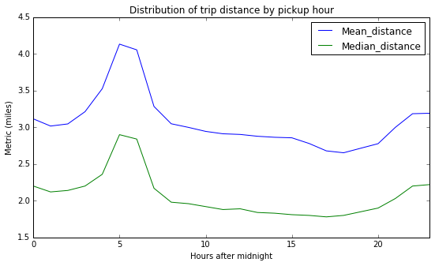


    -----Trip distance by hour of the day-----
    
      Hour    Mean distance    Median distance
    ------  ---------------  -----------------
         0          3.11528               2.2
         1          3.01735               2.12
         2          3.04618               2.14
         3          3.21295               2.2
         4          3.52656               2.36
         5          4.13347               2.9
         6          4.05515               2.84
         7          3.28439               2.17
         8          3.04845               1.98
         9          2.99911               1.96
        10          2.94448               1.92
        11          2.91202               1.88
        12          2.90306               1.89
        13          2.87829               1.84
        14          2.8643                1.83
        15          2.85704               1.81
        16          2.77985               1.8
        17          2.67911               1.78
        18          2.65322               1.8
        19          2.7156                1.85
        20          2.77705               1.9
        21          2.99919               2.03
        22          3.18539               2.2
        23          3.19154               2.22


-> We observe long range trips in the morning and evenings. Are these people commuting to work? If so how do they get back home. The evening peak are shorter than the morning peak. I would hypothesize that people are okay to take cabs in the morning to avoid being late to their early appointments while they would take public transportation in the evening. However, this might not apply to NYC

***Let's also compare trips that originate (or terminate) from (at) one of the NYC airports. We can look at how many they are, the average fair, ...***

Reading through the dictionary of variables, I found that the variable RateCodeID contains values indicating the final rate that was applied. Among those values, I realized that there is Newark and JFK which are the major airports in New York. In this part, I will use this knowledge and group data with RateCodeID 2 (JFK) and 3 (Newark). - An alternative (which I didn't due to time constraint) is to (1) get coordinates of airports from google map or http://transtats.bts.gov (2) get at least 4 points defining a rectangular buffer zone near the airport (3) build a polygon shape using shapely [https://pypi.python.org/pypi/Shapely] and (3) check if any pickup/dropoff location coordinates is within the polygon using shapely again. This method was first tried but was found to be time consuming -


```python
# select airport trips
airports_trips = data[(data.RateCodeID==2) | (data.RateCodeID==3)]
print "Number of trips to/from NYC airports: ", airports_trips.shape[0]
print "Average fare (calculated by the meter) of trips to/from NYC airports: $", airports_trips.Fare_amount.mean(),"per trip"
print "Average total charged amount (before tip) of trips to/from NYC airports: $", airports_trips.Total_amount.mean(),"per trip"
```

    Number of trips to/from NYC airports:  5552
    Average fare (calculated by the meter) of trips to/from NYC airports: $ 48.976945245 per trip
    Average total charged amount (before tip) of trips to/from NYC airports: $ 57.208420389 per trip


In addition to the number and mean fare of airport trips, let's have aso look at how trips are distributed by trip distances and hour of the day


```python
# create a vector to contain Trip Distance for
v2 = airports_trips.Trip_distance # airport trips
v3 = data.loc[~data.index.isin(v2.index),'Trip_distance'] # non-airport trips

# remove outliers: 
# exclude any data point located further than 3 standard deviations of the median point and 
# plot the histogram with 30 bins
v2 = v2[~((v2-v2.median()).abs()>3*v2.std())]
v3 = v3[~((v3-v3.median()).abs()>3*v3.std())] 

# define bins boundaries
bins = np.histogram(v2,normed=True)[1]
h2 = np.histogram(v2,bins=bins,normed=True)
h3 = np.histogram(v3,bins=bins,normed=True)

# plot distributions of trip distance normalized among groups
fig,ax = plt.subplots(1,2,figsize = (15,4))
w = .4*(bins[1]-bins[0])
ax[0].bar(bins[:-1],h2[0],alpha=1,width=w,color='b')
ax[0].bar(bins[:-1]+w,h3[0],alpha=1,width=w,color='g')
ax[0].legend(['Airport trips','Non-airport trips'],loc='best',title='group')
ax[0].set_xlabel('Trip distance (miles)')
ax[0].set_ylabel('Group normalized trips count')
ax[0].set_title('A. Trip distance distribution')
#ax[0].set_yscale('log')

# plot hourly distribution
airports_trips.Pickup_hour.value_counts(normalize=True).sort_index().plot(ax=ax[1])
data.loc[~data.index.isin(v2.index),'Pickup_hour'].value_counts(normalize=True).sort_index().plot(ax=ax[1])
ax[1].set_xlabel('Hours after midnight')
ax[1].set_ylabel('Group normalized trips count')
ax[1].set_title('B. Hourly distribution of trips')
ax[1].legend(['Airport trips','Non-airport trips'],loc='best',title='group')
plt.savefig('Question3_2.jpeg',format='jpeg')
plt.show()
```


A. The trip distance distribution shows two peaks. Airport trips follow the same trend as the rest of the trips for short trips (trip distance ≤ 2miles). However, there is also an increased number of long range trips (18 miles) which might correspond to a great number people coming to airports from further residential areas. A check on google map shows that the distance between JFK and Manhattan is about 18 miles whereas Newark to Manhattan is 15 miles.

B. The hourly distribution shows that the number of trips at airports peaks around 3PM while it peaks 2 hours later. On the other hand, there is a shortage in airports riders at 2AM while the rest of NYC goes completely down 3 hours later 5AM.

## Predictive model
In this section, I am going to guide my analysis towards building a model to predict the percentage tip

***1. Let's build a derived variable for tip as a percentage of the total fare.***

Before we proceed with this, some cleaning is necessary. 
Since the [initial charge for NYC green taxi is $2.5](http://www.nyc.gov/html/tlc/html/passenger/taxicab_rate.shtml), any transaction with a smaller total amount  is invalid, thus it is to be dropped


```python
data = data[(data.Total_amount>=2.5)] #cleaning
data['Tip_percentage'] = 100*data.Tip_amount/data.Total_amount
print "Summary: Tip percentage\n",data.Tip_percentage.describe()
```

    Summary: Tip percentage
    count    1.487767e+06
    mean     6.665932e+00
    std      8.875835e+00
    min      0.000000e+00
    25%      0.000000e+00
    50%      0.000000e+00
    75%      1.666667e+01
    max      1.000000e+02
    Name: Tip_percentage, dtype: float64


***2. Similarly to the comparison between trips to/from airports with the rest of the trips, it is worthy to spend more time and check wether trips originating from upper manhattan have different percentage tip.***

To identify trips originating from upper manhattan:
- From googgle map, collect latitude and longitude data of at least 12 points that approximately define the bounding box of upper Manhattan 
- Create a polygon using shapely.geometry.Polygon [https://pypi.python.org/pypi/Shapely]
- Check if the polygon contains  a location defined by (latitude,longitude)


```python
# import library
from shapely.geometry import Point,Polygon,MultiPoint
# data points that define the bounding box of the Upper Manhattan
umanhattan = [(40.796937, -73.949503),(40.787945, -73.955822),(40.782772, -73.943575),
              (40.794715, -73.929801),(40.811261, -73.934153),(40.835371, -73.934515),
              (40.868910, -73.911145),(40.872719, -73.910765),(40.878252, -73.926350),
              (40.850557, -73.947262),(40.836225, -73.949899),(40.806050, -73.971255)]

poi = Polygon(umanhattan)
# create a function to check if a location is located inside Upper Manhattan
def is_within_bbox(loc,poi=poi):
    """
    This function returns 1 if a location loc(lat,lon) is located inside a polygon of interest poi
    loc: tuple, (latitude, longitude)
    poi: shapely.geometry.Polygon, polygon of interest
    """
    return 1*(Point(loc).within(poi))
tic = dt.datetime.now()
# Create a new variable to check if a trip originated in Upper Manhattan
data['U_manhattan'] = data[['Pickup_latitude','Pickup_longitude']].apply(lambda r:is_within_bbox((r[0],r[1])),axis=1)
print "Processing time ", dt.datetime.now()-tic
```

    Processing time  0:02:30.273045


- Compare distributions of the two groups


```python
# create a vector to contain Tip percentage for
v1 = data[(data.U_manhattan==0) & (data.Tip_percentage>0)].Tip_percentage
v2 = data[(data.U_manhattan==1) & (data.Tip_percentage>0)].Tip_percentage

# generate bins and histogram values
bins = np.histogram(v1,bins=10)[1]
h1 = np.histogram(v1,bins=bins)
h2 = np.histogram(v2,bins=bins)

# generate the plot
# First suplot: visualize all data with outliers
fig,ax = plt.subplots(1,1,figsize=(10,5))
w = .4*(bins[1]-bins[0])
ax.bar(bins[:-1],h1[0],width=w,color='b')
ax.bar(bins[:-1]+w,h2[0],width=w,color='g')
ax.set_yscale('log')
ax.set_xlabel('Tip (%)')
ax.set_ylabel('Count')
ax.set_title('Tip')
ax.legend(['Non-Manhattan','Manhattah'],title='origin')
plt.show()
print 't-test results:', ttest_ind(v1,v2,equal_var=False)
```


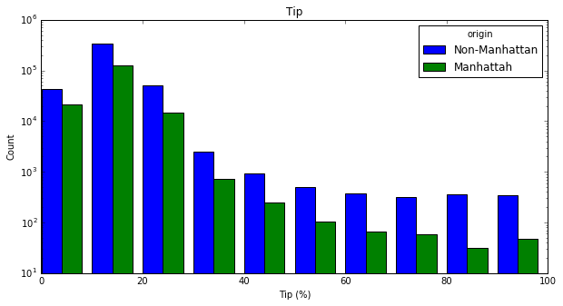


    t-test results: Ttest_indResult(statistic=55.958566779306864, pvalue=0.0)


The two distributions look the same however the t-test results in a zero p-value to imply that the two groups are different at 95% level of condidence

### The Model

#### Summary
The initial dataset contained 1494926 transactions with 21 time-series, categorical and numerical variables. In order to build the final model, four phases were followed (1) data cleaning, (2) feature engineering (3) exploratory data analysis and (4) model creation

The cleaning consisted in drop zero variance variables (Ehail_fee), replacing invalid with the most frequent values in each categorical variable whereas the median was used for continuous numerical variables. Invalid values could be missing values or values not allowed for specific variables as per the [dictionary of variables](http://www.nyc.gov/html/tlc/downloads/pdf/data_dictionary_trip_records_green.pdf). In this part, variables were also converted in their appropriate format such datetime.

The feature engineering part created 10 new variables derived from pickup and dropoff locations and timestamps, trip distance.

During the exploration, each variable was carefully analyzed and compared to other variables and eventually the target variable, Percentage tip. All numerical variables were found to follow lognormal or power law distributions althouth there was found no linear relationship between numerical and the target variable. An interesting insight was uncovered in the distribution of the percentage tip. It was found that only 40% of the transactions paid tip. And 99.99% of these payments were done by credit cards. This inspired me to build the predictive model in two stages (1) classification model to find out weither a transaction will pay tip and (2) regression model to find the percentage of the tip only if the transaction was classified as a tipper. Another insight was that the most frequent percentage is 18% which corresponds to the usual restaurant gratuity rate.

With lack of linear relationship between independent and depend variables, the predictive model was built on top of the random forest regression and gradient boosting classifier algorithms implemented in sklearn after routines to optimize best parameters. A usable script to make predictions as attached to this notebook and available in the same directory.


**Note:** The code to make predictions is provided in the same directory as tip_predictor.py and the instructions are in the recommendation part of this section.

Following, each part of the analysis is fully explained with accompanying python code


```python
# Download the September 2015 dataset
if os.path.exists('data_september_2015.csv'): # Check if the dataset is present on local disk and load it
    data = pd.read_csv('data_september_2015.csv')
else: # Download dataset if not available on disk
    url = "https://s3.amazonaws.com/nyc-tlc/trip+data/green_tripdata_2015-09.csv"
    data = pd.read_csv(url)
    data.to_csv(url.split('/')[-1])

# Print the size of the dataset
print "Number of rows:", data.shape[0]
print "Number of columns: ", data.shape[1]

# create backup dataset
backup_data = data.copy()
```

    Number of rows: 1494926
    Number of columns:  21


#### 1 Data cleaning
This part concerns work done to treat invalid data.

- Ehail_fee was removed since 99% of the data are missing
- Missing values in Trip_type were replace with the most common value that was 1
- Invalid data were found in:
    - RateCodeID: about 0.01% of the values were 99. These were replaced by the most common value 2
    - Extra: 0.08% of transactions had negative Extra. These were replaced by 0 as the most frequent
    - Total_amount, Fare_amount, improvement_surcharge, Tip_amount: 0.16% of values were negative. The cases were considered as being machine errors during the data entry. They were replaced by their absolute values. Furthermore, as the minimum Total_amount that is chargeable for any service is $2.5, every transaction falling below that amount was replaced by the median value of the Total_amount 11.76.

The code is provided below


```python
# define a function to clean a loaded dataset

def clean_data(adata):
    """
    This function cleans the input dataframe adata:
    . drop Ehail_fee [99% transactions are NaNs]
    . impute missing values in Trip_type
    . replace invalid data by most frequent value for RateCodeID and Extra
    . encode categorical to numeric
    . rename pickup and dropff time variables (for later use)
    
    input:
        adata: pandas.dataframe
    output: 
        pandas.dataframe

    """
    ## make a copy of the input
    data = adata.copy()
    ## drop Ehail_fee: 99% of its values are NaNs
    if 'Ehail_fee' in data.columns:
        data.drop('Ehail_fee',axis=1,inplace=True)

    ##  replace missing values in Trip_type with the most frequent value 1
    data['Trip_type '] = data['Trip_type '].replace(np.NaN,1)
    
    ## replace all values that are not allowed as per the variable dictionary with the most frequent allowable value
    # remove negative values from Total amound and Fare_amount
    print "Negative values found and replaced by their abs"
    print "Total_amount", 100*data[data.Total_amount<0].shape[0]/float(data.shape[0]),"%"
    print "Fare_amount", 100*data[data.Fare_amount<0].shape[0]/float(data.shape[0]),"%"
    print "Improvement_surcharge", 100*data[data.improvement_surcharge<0].shape[0]/float(data.shape[0]),"%"
    print "Tip_amount", 100*data[data.Tip_amount<0].shape[0]/float(data.shape[0]),"%"
    print "Tolls_amount", 100*data[data.Tolls_amount<0].shape[0]/float(data.shape[0]),"%"
    print "MTA_tax", 100*data[data.MTA_tax<0].shape[0]/float(data.shape[0]),"%"
    data.Total_amount = data.Total_amount.abs()
    data.Fare_amount = data.Fare_amount.abs()
    data.improvement_surcharge = data.improvement_surcharge.abs()
    data.Tip_amount = data.Tip_amount.abs()
    data.Tolls_amount = data.Tolls_amount.abs()
    data.MTA_tax = data.MTA_tax.abs()
    
    # RateCodeID
    indices_oi = data[~((data.RateCodeID>=1) & (data.RateCodeID<=6))].index
    data.loc[indices_oi, 'RateCodeID'] = 2 # 2 = Cash payment was identified as the common method
    print round(100*len(indices_oi)/float(data.shape[0]),2),"% of values in RateCodeID were invalid.--> Replaced by the most frequent 2"
    
    # Extra
    indices_oi = data[~((data.Extra==0) | (data.Extra==0.5) | (data.Extra==1))].index
    data.loc[indices_oi, 'Extra'] = 0 # 0 was identified as the most frequent value
    print round(100*len(indices_oi)/float(data.shape[0]),2),"% of values in Extra were invalid.--> Replaced by the most frequent 0"
    
    # Total_amount: the minimum charge is 2.5, so I will replace every thing less than 2.5 by the median 11.76 (pre-obtained in analysis)
    indices_oi = data[(data.Total_amount<2.5)].index
    data.loc[indices_oi,'Total_amount'] = 11.76
    print round(100*len(indices_oi)/float(data.shape[0]),2),"% of values in total amount worth <$2.5.--> Replaced by the median 1.76"
    
    # encode categorical to numeric (I avoid to use dummy to keep dataset small)
    if data.Store_and_fwd_flag.dtype.name != 'int64':
        data['Store_and_fwd_flag'] = (data.Store_and_fwd_flag=='Y')*1
    
    # rename time stamp variables and convert them to the right format
    print "renaming variables..."
    data.rename(columns={'lpep_pickup_datetime':'Pickup_dt','Lpep_dropoff_datetime':'Dropoff_dt'},inplace=True)
    print "converting timestamps variables to right format ..."
    data['Pickup_dt'] = data.Pickup_dt.apply(lambda x:dt.datetime.strptime(x,"%Y-%m-%d %H:%M:%S"))
    data['Dropoff_dt'] = data.Dropoff_dt.apply(lambda x:dt.datetime.strptime(x,"%Y-%m-%d %H:%M:%S"))
    
    print "Done cleaning"
    return data
```


```python
# Run code to clean the data
data = clean_data(data)
```

    Negative values found and replaced by their abs
    Total_amount 0.161680243704 %
    Fare_amount 0.161680243704 %
    Improvement_surcharge 0.148167869179 %
    Tip_amount 0.00254193184144 %
    Tolls_amount 0.000468250602371 %
    MTA_tax 0.146294866769 %
    0.0 % of values in RateCodeID were invalid.--> Replaced by the most frequent 2
    0.08 % of values in Extra were invalid.--> Replaced by the most frequent 0
    0.32 % of values in total amount worth <$2.5.--> Replaced by the median 1.76
    renaming variables...
    converting timestamps variables to right format ...
    Done cleaning


#### 2 Feature engineering
In this step, I intuitively created new varibles derived from current variables. 

- Time variables: Week, Month_day(Day of month), Week_day (Day of week), Hour (hour of day), Shift_type (shift period of the day) and Trip_duration.The were created under the hypothesis that people may be willing to tip depending on the week days or time of the day. For instance, people are more friendly and less stressful to easily tip over the weekend. They were derived from pickup time
- Trip directions: Direction_NS (is the cab moving Northt to South?) and Direction_EW (is the cab moving East to West). These are components of the two main directions, horizontal and vertical. The hypothesis is that the traffic may be different in different directions and it may affect the riders enthousiasm to tipping. They were derived from pickup and dropoff coordinates
- Speed: this the ratio of Trip_distance to Trip_duration. At this level, all entries with speeds higher than 240 mph were dropped since this is the typical highest speed for cars commonly used as taxi [in addition to the fact that the speed limit in NYC is 50 mph](http://nytrafficticket.com/fastest-road-in-america-and-maximum-speed-limits-in-new-york/). An alternative filter threshold would be the highest posted speed limit in NYC but it might be sometimes violated.
- With_tip: This is to identify transactions with tips or not. This variable was created after discovering that 60% of transactions have 0 tip.
- As seen that using the mean of trips from Manhattan is different from the mean from other boroughs, this variable can be considered as well in the model building. A further and deep analysis, would be to create a variable of the origin and destination of each trip. This was tried but it was computationally excessive to my system. Here, coming from Manhattan or not, is the only variable to be used.


```python
# Function to run the feature engineering
def engineer_features(adata):
    """
    This function create new variables based on present variables in the dataset adata. It creates:
    . Week: int {1,2,3,4,5}, Week a transaction was done
    . Week_day: int [0-6], day of the week a transaction was done
    . Month_day: int [0-30], day of the month a transaction was done
    . Hour: int [0-23], hour the day a transaction was done
    . Shift type: int {1=(7am to 3pm), 2=(3pm to 11pm) and 3=(11pm to 7am)}, shift of the day  
    . Speed_mph: float, speed of the trip
    . Tip_percentage: float, target variable
    . With_tip: int {0,1}, 1 = transaction with tip, 0 transction without tip
    
    input:
        adata: pandas.dataframe
    output: 
        pandas.dataframe
    """
    
    # make copy of the original dataset
    data = adata.copy()
    
    # derive time variables
    print "deriving time variables..."
    ref_week = dt.datetime(2015,9,1).isocalendar()[1] # first week of september in 2015
    data['Week'] = data.Pickup_dt.apply(lambda x:x.isocalendar()[1])-ref_week+1
    data['Week_day']  = data.Pickup_dt.apply(lambda x:x.isocalendar()[2])
    data['Month_day'] = data.Pickup_dt.apply(lambda x:x.day)
    data['Hour'] = data.Pickup_dt.apply(lambda x:x.hour)
    #data.rename(columns={'Pickup_hour':'Hour'},inplace=True)

    # create shift variable:  1=(7am to 3pm), 2=(3pm to 11pm) and 3=(11pm to 7am)
    data['Shift_type'] = np.NAN
    data.loc[data[(data.Hour>=7) & (data.Hour<15)].index,'Shift_type'] = 1
    data.loc[data[(data.Hour>=15) & (data.Hour<23)].index,'Shift_type'] = 2
    data.loc[data[data.Shift_type.isnull()].index,'Shift_type'] = 3
    
    # Trip duration 
    print "deriving Trip_duration..."
    data['Trip_duration'] = ((data.Dropoff_dt-data.Pickup_dt).apply(lambda x:x.total_seconds()/60.))
    
    print "deriving direction variables..."
    # create direction variable Direction_NS. 
    # This is 2 if taxi moving from north to south, 1 in the opposite direction and 0 otherwise
    data['Direction_NS'] = (data.Pickup_latitude>data.Dropoff_latitude)*1+1
    indices = data[(data.Pickup_latitude == data.Dropoff_latitude) & (data.Pickup_latitude!=0)].index
    data.loc[indices,'Direction_NS'] = 0

    # create direction variable Direction_EW. 
    # This is 2 if taxi moving from east to west, 1 in the opposite direction and 0 otherwise
    data['Direction_EW'] = (data.Pickup_longitude>data.Dropoff_longitude)*1+1
    indices = data[(data.Pickup_longitude == data.Dropoff_longitude) & (data.Pickup_longitude!=0)].index
    data.loc[indices,'Direction_EW'] = 0
    
    # create variable for Speed
    print "deriving Speed. Make sure to check for possible NaNs and Inf vals..."
    data['Speed_mph'] = data.Trip_distance/(data.Trip_duration/60)
    # replace all NaNs values and values >240mph by a values sampled from a random distribution of 
    # mean 12.9 and  standard deviation 6.8mph. These values were extracted from the distribution
    indices_oi = data[(data.Speed_mph.isnull()) | (data.Speed_mph>240)].index
    data.loc[indices_oi,'Speed_mph'] = np.abs(np.random.normal(loc=12.9,scale=6.8,size=len(indices_oi)))
    print "Feature engineering done! :-)"
    
    # Create a new variable to check if a trip originated in Upper Manhattan
    print "checking where the trip originated..."
    data['U_manhattan'] = data[['Pickup_latitude','Pickup_longitude']].apply(lambda r:is_within_bbox((r[0],r[1])),axis=1)
    
    # create tip percentage variable
    data['Tip_percentage'] = 100*data.Tip_amount/data.Total_amount
    
    # create with_tip variable
    data['With_tip'] = (data.Tip_percentage>0)*1

    return data


# collected bounding box points
umanhattan = [(40.796937, -73.949503),(40.787945, -73.955822),(40.782772, -73.943575),
              (40.794715, -73.929801),(40.811261, -73.934153),(40.835371, -73.934515),
              (40.868910, -73.911145),(40.872719, -73.910765),(40.878252, -73.926350),
              (40.850557, -73.947262),(40.836225, -73.949899),(40.806050, -73.971255)]

poi = Polygon(umanhattan)
# create a function to check if a location is located inside Upper Manhattan
def is_within_bbox(loc,poi=poi):
    """
    This function checks if a location loc with lat and lon is located within the polygon of interest
    input:
    loc: tuple, (latitude, longitude)
    poi: shapely.geometry.Polygon, polygon of interest
    """
    return 1*(Point(loc).within(poi))

```


```python
# run the code to create new features on the dataset
print "size before feature engineering:", data.shape
data = engineer_features(data)
print "size after feature engineering:", data.shape
```

    size before feature engineering: (1494926, 20)
    deriving time variables...
    deriving Trip_duration...
    deriving direction variables...
    deriving Speed. Make sure to check for possible NaNs and Inf vals...
    Feature engineering done! :-)
    checking where the trip originated...
    size after feature engineering: (1494926, 32)


```python
# Uncomment to check for data validity. 
# data.describe() .T
```

#### 3 Exploratory Data Analysis
This was the key phase of my analysis. A look at the distribution of the target variable, "Tip_percentage" showed that 60% of all transactions did not give tip (see Figure below, left). A second tip at 18% corresponds to the usual NYC customary gratuity rate which fluctuates between 18% and 25% (see Figure below,right). Based on this information, the model can be built in two steps

1. Create classification model to predict weither tip will be given or not. Here a new variable "With_tip" of 1 (if there is tip) and 0 (otherwise) was created.
2. Create regression model for transaction with non-zero tip


```python
## code to compare the two Tip_percentage identified groups
# split data in the two groups
data1 = data[data.Tip_percentage>0]
data2 = data[data.Tip_percentage==0]

# generate histograms to compare
fig,ax=plt.subplots(1,2,figsize=(14,4))
data.Tip_percentage.hist(bins = 20,normed=True,ax=ax[0])
ax[0].set_xlabel('Tip (%)')
ax[0].set_title('Distribution of Tip (%) - All transactions')

data1.Tip_percentage.hist(bins = 20,normed=True,ax=ax[1])
ax[1].set_xlabel('Tip (%)')
ax[1].set_title('Distribution of Tip (%) - Transaction with tips')
ax[1].set_ylabel('Group normed count')
plt.savefig('Question4_target_varc.jpeg',format='jpeg')
plt.show()
```


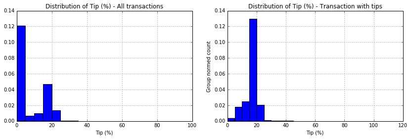


Next, each variable distribution and its relationship with the Tip percentage were explored. Few functions were implemented to quickly explore those variables:


```python
# Functions for exploratory data analysis
def visualize_continuous(df,label,method={'type':'histogram','bins':20},outlier='on'):
    """
    function to quickly visualize continous variables
    df: pandas.dataFrame 
    label: str, name of the variable to be plotted. It should be present in df.columns
    method: dict, contains info of the type of plot to generate. It can be histogram or boxplot [-Not yet developped]
    outlier: {'on','off'}, Set it to off if you need to cut off outliers. Outliers are all those points
    located at 3 standard deviations further from the mean
    """
    # create vector of the variable of interest
    v = df[label]
    # define mean and standard deviation
    m = v.mean()
    s = v.std()
    # prep the figure
    fig,ax = plt.subplots(1,2,figsize=(14,4))
    ax[0].set_title('Distribution of '+label)
    ax[1].set_title('Tip % by '+label)
    if outlier=='off': # remove outliers accordingly and update titles
        v = v[(v-m)<=3*s]
        ax[0].set_title('Distribution of '+label+'(no outliers)')
        ax[1].set_title('Tip % by '+label+'(no outliers)')
    if method['type'] == 'histogram': # plot the histogram
        v.hist(bins = method['bins'],ax=ax[0])
    if method['type'] == 'boxplot': # plot the box plot
        df.loc[v.index].boxplot(label,ax=ax[0])
    ax[1].plot(v,df.loc[v.index].Tip_percentage,'.',alpha=0.4)
    ax[0].set_xlabel(label)
    ax[1].set_xlabel(label)
    ax[0].set_ylabel('Count')
    ax[1].set_ylabel('Tip (%)')

def visualize_categories(df,catName,chart_type='histogram',ylimit=[None,None]):
    """
    This functions helps to quickly visualize categorical variables. 
    This functions calls other functions generate_boxplot and generate_histogram
    df: pandas.Dataframe
    catName: str, variable name, it must be present in df
    chart_type: {histogram,boxplot}, choose which type of chart to plot
    ylim: tuple, list. Valid if chart_type is histogram
    """
    print catName
    cats = sorted(pd.unique(df[catName]))
    if chart_type == 'boxplot': #generate boxplot
        generate_boxplot(df,catName,ylimit)
    elif chart_type == 'histogram': # generate histogram
        generate_histogram(df,catName)
    else:
        pass
    
    #=> calculate test statistics
    groups = df[[catName,'Tip_percentage']].groupby(catName).groups #create groups
    tips = df.Tip_percentage
    if len(cats)<=2: # if there are only two groups use t-test
        print ttest_ind(tips[groups[cats[0]]],tips[groups[cats[1]]])
    else: # otherwise, use one_way anova test
        # prepare the command to be evaluated
        cmd = "f_oneway("
        for cat in cats:
            cmd+="tips[groups["+str(cat)+"]],"
        cmd=cmd[:-1]+")"
        print "one way anova test:", eval(cmd) #evaluate the command and print
    print "Frequency of categories (%):\n",df[catName].value_counts(normalize=True)*100
    
def test_classification(df,label,yl=[0,50]):
    """
    This function test if the means of the two groups with_tip and without_tip are different at 95% of confidence level.
    It will also generate a box plot of the variable by tipping groups
    label: str, label to test
    yl: tuple or list (default = [0,50]), y limits on the ylabel of the boxplot
    df: pandas.DataFrame (default = data)
    
    Example: run <visualize_continuous(data,'Fare_amount',outlier='on')>
    """
    
    if len(pd.unique(df[label]))==2: #check if the variable is categorical with only two  categores and run chisquare test
        vals=pd.unique(df[label])
        gp1 = df[df.With_tip==0][label].value_counts().sort_index()
        gp2 = df[df.With_tip==1][label].value_counts().sort_index()
        print "t-test if", label, "can be used to distinguish transaction with tip and without tip"
        print chisquare(gp1,gp2)
    elif len(pd.unique(df[label]))>=10: #other wise  run the t-test
        df.boxplot(label,by='With_tip')
        plt.ylim(yl)
        plt.show()
        print "t-test if", label, "can be used to distinguish transaction with tip and without tip"
        print "results:",ttest_ind(df[df.With_tip==0][label].values,df[df.With_tip==1][label].values,False)
    else:
        pass

def generate_boxplot(df,catName,ylimit):
    """
    generate boxplot of tip percentage by variable "catName" with ylim set to ylimit
    df: pandas.Dataframe
    catName: str
    ylimit: tuple, list
    """
    df.boxplot('Tip_percentage',by=catName)
    #plt.title('Tip % by '+catName)
    plt.title('')
    plt.ylabel('Tip (%)')
    if ylimit != [None,None]:
        plt.ylim(ylimit)
    plt.show()

def generate_histogram(df,catName):
    """
    generate histogram of tip percentage by variable "catName" with ylim set to ylimit
    df: pandas.Dataframe
    catName: str
    ylimit: tuple, list
    """
    cats = sorted(pd.unique(df[catName]))
    colors = plt.cm.jet(np.linspace(0,1,len(cats)))
    hx = np.array(map(lambda x:round(x,1),np.histogram(df.Tip_percentage,bins=20)[1]))
    fig,ax = plt.subplots(1,1,figsize = (15,4))
    for i,cat in enumerate(cats):
        vals = df[df[catName] == cat].Tip_percentage
        h = np.histogram(vals,bins=hx)
        w = 0.9*(hx[1]-hx[0])/float(len(cats))
        plt.bar(hx[:-1]+w*i,h[0],color=colors[i],width=w)
    plt.legend(cats)
    plt.yscale('log')
    plt.title('Distribution of Tip by '+catName)
    plt.xlabel('Tip (%)')
```

Starting with continuous variables, two main insights were discovered: A lognormal-like or power law distribution of the Fare amount and a non-linear function of the tip percentage as function of the total amount. The tip percentage decreases as the fare amount increases but converges around 20%. The density of scattered points implies that there is a high frequency of smaller tipps at low Fare_amount. Can we say that people restrain themselves to tipping more money as the cost of the ride becomes more and more expensive? Or since the fare grows with the length of the trip and trip duration, can we say that riders get bored and don't appreciate the service they are getting? Many questsions can be explored at this point


```python
# Example of exploration of the Fare_amount using the implented code:
visualize_continuous(data1,'Fare_amount',outlier='on')
test_classification(data,'Fare_amount',[0,25])
```


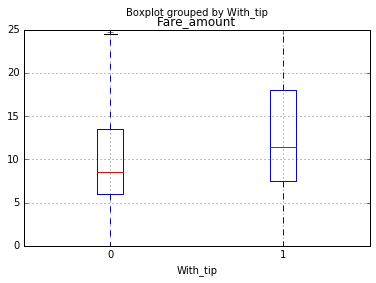


    t-test if Fare_amount can be used to distinguish transaction with tip and without tip
    results: Ttest_indResult(statistic=-167.00096498871079, pvalue=0.0)


A negative t-test value and null p-value imply that the means of Total_amount are significantly different in the group of transactions with tips compared to the group with no tip. Therefore, this variable would used to train the classification model.

Using the same function, a plot of the tip percentage as function of trip duration showed a cluster of points at duration time greater than 1350 min (22 hours). 


These points look like outliers since it doesn't make sense to have a trip of 22 hours within NYC. Probably, tourists can! 

The following code was used to analyze the cluser with trip duration greater than 1350 min


```python
# Code to generate the heat map to uncover hidden information in the cluster
# We will first source NYC boroughs shape files, 
# then create polygons and check to which polygon does each of the point of the cluster begongs

## download geojson of NYC boroughs
nyc_boros = json.loads(requests.get("https://raw.githubusercontent.com/dwillis/nyc-maps/master/boroughs.geojson").content)

# parse boros into Multipolygons
boros = {}
for f in nyc_boros['features']:
    name = f['properties']['BoroName']
    code = f['properties']['BoroCode']
    polygons = []
    for p in f['geometry']['coordinates']:
        polygons.append(Polygon(p[0]))
    boros[code] = {'name':name,'polygon':MultiPolygon(polygons=polygons)}
    
# creae function to assign each coordinates point to its borough
def find_borough(lat,lon):
    """
    return the borough of a location given its latitude and longitude
    lat: float, latitude
    lon: float, longitude
    """
    boro = 0 # initialize borough as 0
    for k,v in boros.iteritems(): # update boro to the right key corresponding to the parent polygon
        if v['polygon'].contains(Point(lon,lat)):
            boro = k
            break # break the loop once the borough is found
    return [boro]

## Analyse the cluster now
# create data frame of boroughs
df = data1[data1.Trip_duration>=1350]
orig_dest = []
for v in df[['Pickup_latitude','Pickup_longitude','Dropoff_latitude','Dropoff_longitude']].values:
    orig_dest.append((find_borough(v[0],v[1])[0],find_borough(v[2],v[3])[0]))
df2 = pd.DataFrame(orig_dest)

## creae pivot table for the heat map plot
df2['val']=1 # dummy variable
mat_cluster1 = df2.pivot_table(index=0,columns=1,values='val',aggfunc='count')

## generate the map
fig,ax = plt.subplots(1,2,figsize=(15,4))
im = ax[0].imshow(mat_cluster1)
ax[0].set_ylabel('From')
ax[0].set_xlabel('To')
ax[0].set_xticklabels(['','Other','Manhattan','Bronx','Brooklyn','Queens'],rotation='vertical')
ax[0].set_yticklabels(['','Other','Manhattan','Bronx','Brooklyn','Queens'])
ax[0].set_title('Cluster of rides with duration >1350 min')
fig.colorbar(im,ax=ax[0])
h = df.Hour.value_counts(normalize=True)
plt.bar(h.index,h.values,width = .4,color='b')
h = data1.Hour.value_counts(normalize=True)
ax[1].bar(h.index+.4,h.values,width = .4,color='g')
ax[1].set_title('Hourly traffic: All rides vs cluster rides')
ax[1].legend(['cluster','all'],loc='best')
ax[1].set_xlabel('Hour')
ax[1].set_xticks(np.arange(25)+.4,range(25))
ax[1].set_ylabel('Normalized Count')
plt.savefig('duration_cluster.jpeg',format='jpeg')
plt.show()
```


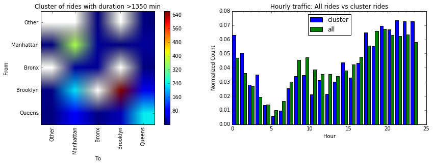


The heat map color represents the number of trips between two given boroughs. We can see that the majority of the trips  are intra-boroughs. There is a great number of trips from Brooklyn to Manhattan whereas there is no Staten Island trip that takes more than 1350 minutes. Are there specific hours for these events? Unfortunately, the distribution on the rigtht shows that the cluster behaves the same as the rest of the traffic.


Finally, correlation heatmap was used to find which independent variables are correlated to each other. The following code provides the construction of the correlation heatmap


```python
continuous_variables=['Total_amount','Fare_amount','Trip_distance','Trip_duration','Tolls_amount','Speed_mph','Tip_percentage']
cor_mat = data1[continuous_variables].corr()
#fig,ax = plt.subplots(1,1,figsize = [6,6])
plt.imshow(cor_mat)
plt.xticks(range(len(continuous_variables)),continuous_variables,rotation='vertical')
plt.yticks(range(len(continuous_variables)),continuous_variables)
plt.colorbar()
plt.title('Correlation between continuous variables')
plt.show()
#print cor_mat
```


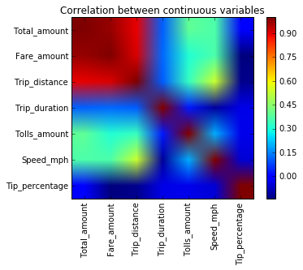


***A further analysis of all continuous variables revealed similar lognormal and non-linearlity behaviors. Since there is no linear relationship between the the Tip percentage and variables, random forest algorithm will be considered to build the regression part of the model***

As far as categorical variables concerned, the function visualize_categories was used to explore each variable as it was done for continuous numerical variables (See demostration below)


```python
# exploration of the U_manhattan (trip originating from Upper Manhattan) variable 
visualize_categories(data1,'U_manhattan','boxplot',[13,20])
test_classification(data,'U_manhattan')
```

    U_manhattan


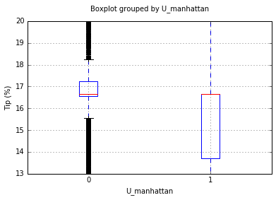


    Ttest_indResult(statistic=52.889791995361328, pvalue=0.0)
    Frequency of categories (%):
    0    73.053072
    1    26.946928
    Name: U_manhattan, dtype: float64
    t-test if U_manhattan can be used to distinguish transaction with tip and without tip
    Power_divergenceResult(statistic=139520.27862838889, pvalue=0.0)


The above plot compares the means and range of the Tip_percentage between trips originating from Manhattan and the rest of the trips. The t-test reported says that these groups have different means. Furthermore, a chi-square test shows that this variable can be used to significantly distinguish transactions with tips from those without tips. 

Another interesting figure is that of the Payment_type.


```python
# visualization of the Payment_type
visualize_categories(data1,'Payment_type','histogram',[13,20])
```

    Payment_type
    one way anova test: F_onewayResult(statistic=122.42820678627095, pvalue=2.8505858052923176e-79)
    Frequency of categories (%):
    1    99.993364
    3     0.005807
    4     0.000498
    2     0.000332
    Name: Payment_type, dtype: float64


This distribution shows that 99.99% transactions with tips were paid by Credit Card (method 1). This variable is not a good candidate for the regression model because of this unbalanced frequenced but it is eventually an important feature to use in the classification model. An intuitive rule would be that if a rider is not paying with a credit card, there will be no tip.

Similar analysis were carried on every variable in order to find the most important variables with enough variance for either the regression model and/or classification model. This visual exploration analysis and statistical tests section concluded by selecting Total_amount, Fare_amount, Trip_distance, Tolls_amount, Trip_duration, Speed_mph, U_manhattan, Direction_NS and Direction_EW as initial important features to train and optimized the regression model. Payment_type, Passenger_count, Extra, Week_day, Hour, Direction_NS, Direction_EW, U_manhattan and Shift_type were selected as initial variables to train the classification model. 

#### 5 Building the Model

As explained in the previous section, this model will be a combination of rules from two models (1) The classification model to classify a transaction into a tipper (=1) or not (=0)and (2) regression model to estimate the percentage of the tip given that the results from the classification model was 1

First of all, functions for cross-validation and parameter optimization were defined such that they can be used on either classification or regression algorithm


```python
# import scikit learn libraries
from sklearn import cross_validation, metrics   #model optimization and valuation tools
from sklearn.grid_search import GridSearchCV   #Perforing grid search

# define a function that help to train models and perform cv
def modelfit(alg,dtrain,predictors,target,scoring_method,performCV=True,printFeatureImportance=True,cv_folds=5):
    """
    This functions train the model given as 'alg' by performing cross-validation. It works on both regression and classification
    alg: sklearn model
    dtrain: pandas.DataFrame, training set
    predictors: list, labels to be used in the model training process. They should be in the column names of dtrain
    target: str, target variable
    scoring_method: str, method to be used by the cross-validation to valuate the model
    performCV: bool, perform Cv or not
    printFeatureImportance: bool, plot histogram of features importance or not
    cv_folds: int, degree of cross-validation
    """
    # train the algorithm on data
    alg.fit(dtrain[predictors],dtrain[target])
    #predict on train set:
    dtrain_predictions = alg.predict(dtrain[predictors])
    if scoring_method == 'roc_auc':
        dtrain_predprob = alg.predict_proba(dtrain[predictors])[:,1]
    
    #perform cross-validation
    if performCV:
        cv_score = cross_validation.cross_val_score(alg,dtrain[predictors],dtrain[target],cv=cv_folds,scoring=scoring_method)
        #print model report
        print "\nModel report:"
        if scoring_method == 'roc_auc':
            print "Accuracy:",metrics.accuracy_score(dtrain[target].values,dtrain_predictions)
            print "AUC Score (Train):",metrics.roc_auc_score(dtrain[target], dtrain_predprob)
        if (scoring_method == 'mean_squared_error'):
            print "Accuracy:",metrics.mean_squared_error(dtrain[target].values,dtrain_predictions)
    if performCV:
        print "CV Score - Mean : %.7g | Std : %.7g | Min : %.7g | Max : %.7g" % (np.mean(cv_score),np.std(cv_score),np.min(cv_score),np.max(cv_score))
    #print feature importance
    if printFeatureImportance:
        if dir(alg)[0] == '_Booster': #runs only if alg is xgboost
            feat_imp = pd.Series(alg.booster().get_fscore()).sort_values(ascending=False)
        else:
            feat_imp = pd.Series(alg.feature_importances_,predictors).sort_values(ascending=False)
        feat_imp.plot(kind='bar',title='Feature Importances')
        plt.ylabel('Feature Importe Score')
        plt.show()

# optimize n_estimator through grid search
def optimize_num_trees(alg,param_test,scoring_method,train,predictors,target):
    """
    This functions is used to tune paremeters of a predictive algorithm
    alg: sklearn model,
    param_test: dict, parameters to be tuned
    scoring_method: str, method to be used by the cross-validation to valuate the model
    train: pandas.DataFrame, training data
    predictors: list, labels to be used in the model training process. They should be in the column names of dtrain
    target: str, target variable
    """
    gsearch = GridSearchCV(estimator=alg, param_grid = param_test, scoring=scoring_method,n_jobs=2,iid=False,cv=5)
    gsearch.fit(train[predictors],train[target])
    return gsearch

# plot optimization results
def plot_opt_results(alg):
    cv_results = []
    for i in range(len(param_test['n_estimators'])):
        cv_results.append((alg.grid_scores_[i][1],alg.grid_scores_[i][0]['n_estimators']))
    cv_results = pd.DataFrame(cv_results)
    plt.plot(cv_results[1],cv_results[0])
    plt.xlabel('# trees')
    plt.ylabel('score')
    plt.title('optimization report')
```

##### 5.1. Classification Model 
After spending a time on feature exploration, engineering and discovering that the Payment_type was a strong variable (99.99% of all transactions with tips were paid with credit cards) to differentiate transactions with tip from those without tip, a model based on the logistic regression classifier algorithm was optimized and gave an accuracy score of 0.94. However, this was outperformed by using the GradientBoostingClassifier (from scikit learn) which gave a score of 0.96. Starting with the GradientBoostinClassier model (default paremeters), the number of trees was optimized through a grid search (see function 'optimize_num_trees').

*-- Key points --*:

- Sample size for training and optimization was chosen as 100000. This is surely a small sample size compared to the available data but the optimization was stable and good enough with 5 folds cross-validation
- Only the number of trees were optimized as they are the controlling key of boosting model accuracy. Other parameters were not optimized since the improvement yield was too small compared to the computation time and cost
- ROC-AUC (Area under the curve of receiver operating characteristic) was used as a model validation metric

*-- Results --*:

- optimized number of trees: 130
- optimized variables: ['Payment_type','Total_amount','Trip_duration','Speed_mph','MTA_tax','Extra','Hour','Direction_NS', 'Direction_EW','U_manhattan']
- roc-auc on a different test sample: 0.9636

The following code shows the optimization process


```python
## OPTIMIZATION & TRAINING OF THE CLASSIFIER

from sklearn.ensemble import GradientBoostingClassifier
print "Optimizing the classifier..."

train = data.copy() # make a copy of the training set
# since the dataset is too big for my system, select a small sample size to carry on training and 5 folds cross validation
train = train.loc[np.random.choice(train.index,size=100000,replace=False)]
target = 'With_tip' # set target variable - it will be used later in optimization

tic = dt.datetime.now() # initiate the timing
# for predictors start with candidates identified during the EDA
predictors = ['Payment_type','Total_amount','Trip_duration','Speed_mph','MTA_tax',
              'Extra','Hour','Direction_NS', 'Direction_EW','U_manhattan']

# optimize n_estimator through grid search
param_test = {'n_estimators':range(30,151,20)} # define range over which number of trees is to be optimized


# initiate classification model
model_cls = GradientBoostingClassifier(
    learning_rate=0.1, # use default
    min_samples_split=2,# use default
    max_depth=5,
    max_features='auto',
    subsample=0.8, # try <1 to decrease variance and increase bias
    random_state = 10)

# get results of the search grid
gs_cls = optimize_num_trees(model_cls,param_test,'roc_auc',train,predictors,target)
print gs_cls.grid_scores_, gs_cls.best_params_, gs_cls.best_score_

# cross validate the best model with optimized number of estimators
modelfit(gs_cls.best_estimator_,train,predictors,target,'roc_auc')

# save the best estimator on disk as pickle for a later use
with open('my_classifier.pkl','wb') as fid:
    pickle.dump(gs_cls.best_estimator_,fid)
    fid.close()
    
print "Processing time:", dt.datetime.now()-tic
```

    Optimizing the classifier...
    [mean: 0.98872, std: 0.00039, params: {'n_estimators': 30}, mean: 0.99310, std: 0.00019, params: {'n_estimators': 50}, mean: 0.99497, std: 0.00015, params: {'n_estimators': 70}, mean: 0.99583, std: 0.00017, params: {'n_estimators': 90}, mean: 0.99643, std: 0.00018, params: {'n_estimators': 110}, mean: 0.99674, std: 0.00019, params: {'n_estimators': 130}, mean: 0.99703, std: 0.00019, params: {'n_estimators': 150}] {'n_estimators': 150} 0.997029574513
    
    Model report:
    Accuracy: 0.97661
    AUC Score (Train): 0.998322770441
    CV Score - Mean : 0.9970296 | Std : 0.000194625 | Min : 0.9966848 | Max : 0.9972604


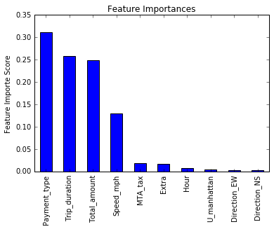


    Processing time: 0:06:14.323000


The output shows that the optimum number of trees in 130 and that the important variables for this specific number of tree are as shown on the barchart. 

Let's test it on a different sample with the following code


```python
# testing on a different set
indices = data.index[~data.index.isin(train.index)]
test = data.loc[np.random.choice(indices,size=100000,replace=False)]

ypred = gs_cls.best_estimator_.predict(test[predictors])

print "ROC AUC:", metrics.roc_auc_score(ypred,test.With_tip)
```

    ROC AUC: 0.967638612693


##### 5.2 Regression Model 
Following a similar pipeline of optimization as in the classification model, a model was built on top of the random forest algorithm. 

*-- Key points --*:
- Sample size for training and optimization was chosen as 100000 with 5 folds cross-validation
- Only the number of trees were optimized as they are the controlling key of boosting model accuracy. Other parameters were not optimized since the improvement yield was too small compared to the computation time and cost
- The mean square error was used as a valuation metric

*-- Results --*:

- optimized number of trees: 150
- optimized variables: Total_amount, Trip_duration, Speed_mph
- mean square error on a different test sample: 14.3648

The following code shows the optimization process


```python
train = data1.copy()
train = train.loc[np.random.choice(train.index,size=100000,replace=False)]
indices = data1.index[~data1.index.isin(train.index)]
test = data1.loc[np.random.choice(indices,size=100000,replace=False)]

train['ID'] = train.index
IDCol = 'ID'
target = 'Tip_percentage'

predictors = ['VendorID', 'Passenger_count', 'Trip_distance', 'Total_amount', 
              'Extra', 'MTA_tax', 'Tolls_amount', 'Payment_type', 
              'Hour', 'U_manhattan', 'Week', 'Week_day', 'Month_day', 'Shift_type', 
              'Direction_NS', 'Direction_EW', 'Trip_duration', 'Speed_mph']
predictors = ['Trip_distance','Tolls_amount', 'Direction_NS', 'Direction_EW', 'Trip_duration', 'Speed_mph']
predictors = ['Total_amount', 'Trip_duration', 'Speed_mph']


# Random Forest
tic = dt.datetime.now()
from sklearn.ensemble import RandomForestRegressor
# optimize n_estimator through grid search
param_test = {'n_estimators':range(50,200,25)} # define range over which number of trees is to be optimized
# initiate classification model
#rfr = RandomForestRegressor(min_samples_split=2,max_depth=5,max_features='auto',random_state = 10)
rfr = RandomForestRegressor()#n_estimators=100)
# get results of the search grid
gs_rfr = optimize_num_trees(rfr,param_test,'mean_squared_error',train,predictors,target)

# print optimization results
print gs_rfr.grid_scores_, gs_rfr.best_params_, gs_rfr.best_score_

# plot optimization results
#plot_opt_results(gs_rfr)

# cross validate the best model with optimized number of estimators
modelfit(gs_rfr.best_estimator_,train,predictors,target,'mean_squared_error')

# save the best estimator on disk as pickle for a later use
with open('my_rfr_reg2.pkl','wb') as fid:
    pickle.dump(gs_rfr.best_estimator_,fid)
    fid.close()

ypred = gs_rfr.best_estimator_.predict(test[predictors])

print 'RFR test mse:',metrics.mean_squared_error(ypred,test.Tip_percentage)
print 'RFR r2:', metrics.r2_score(ypred,test.Tip_percentage)
print dt.datetime.now()-tic
plot_opt_results(gs_rfr)
```

    [mean: -14.82699, std: 0.25730, params: {'n_estimators': 50}, mean: -14.72276, std: 0.27159, params: {'n_estimators': 75}, mean: -14.71941, std: 0.26249, params: {'n_estimators': 100}, mean: -14.72156, std: 0.18053, params: {'n_estimators': 125}, mean: -14.67395, std: 0.20330, params: {'n_estimators': 150}, mean: -14.69674, std: 0.25128, params: {'n_estimators': 175}] {'n_estimators': 150} -14.6739466698
    
    Model report:
    Accuracy: 2.08489338543
    CV Score - Mean : -14.67261 | Std : 0.207763 | Min : -14.88058 | Max : -14.28113


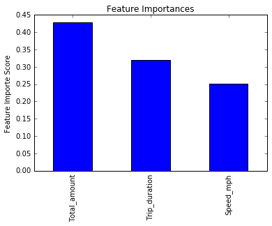


    RFR test mse: 14.7330135666
    RFR r2: 0.254316126587
    0:11:21.474433


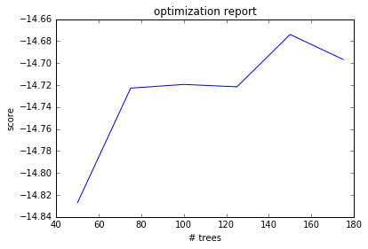


The output shows that the optimum number of trees in 150 and that the important variables for this specific number of tree are as shown on the barchart. 

##### 5.3 Final Model 

This is a combination of the classification model and regression model in order to get the final predictions. The model was run on the entire dataset to predict expected tip percentages. It resulted in a mean squared error of 0.8793.

The process is as follow:
1. get transaction to  predict
2. classify the transaction into zero and non-zero tip
3. if the transaction is classified as non-zero, predict the tip percentage otherwise return 0

Next, I define a function that is to be used to make final predictions


```python
def predict_tip(transaction):
    """
    This function predicts the percentage tip expected on 1 transaction
    transaction: pandas.dataframe, this should have been cleaned first and feature engineered
    """
    # define predictors labels as per optimization results
    cls_predictors = ['Payment_type','Total_amount','Trip_duration','Speed_mph','MTA_tax',
                      'Extra','Hour','Direction_NS', 'Direction_EW','U_manhattan']
    reg_predictors = ['Total_amount', 'Trip_duration', 'Speed_mph']
    
    # classify transactions
    clas = gs_cls.best_estimator_.predict(transaction[cls_predictors])
    
    # predict tips for those transactions classified as 1
    return clas*gs_rfr.best_estimator_.predict(transaction[reg_predictors])


```

Make predictions on a sample of 100000 transactions


```python
test = data.loc[np.random.choice(data.index,size = 100000,replace=False)]
ypred = predict_tip(test)
print "final mean_squared_error:", metrics.mean_squared_error(ypred,test.Tip_percentage)
print "final r2_score:", metrics.r2_score(ypred,test.Tip_percentage)
```

    final mean_squared_error: 8.05943167579
    final r2_score: 0.888821136086


The results are pretty good for a black box model.

Finally, I plot the residuals.


```python
df = test.copy() # make a copy of data
df['predictions'] = ypred # add predictions column
df['residuals'] = df.Tip_percentage - df.predictions # calculate residuals

df.residuals.hist(bins = 20) # plot histogram of residuals
plt.yscale('log')
plt.xlabel('predicted - real')
plt.ylabel('count')
plt.title('Residual plot')
plt.show()
```


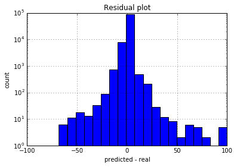


The residual is pretty much symmetrically distributed. This indicate that the model is equally biased. The best model would be the one with mean at 0 and 0 variance

### Recommendations

- As a future work, I would find a transformation function that can linearlize indipendent values. I would also optimize different algorithms such as extreme gradient boosting and make a bag of multiple models as a final model. This was actually tried but failed because of the computational power. 

- The following section is the instruction on how to use the predictor script


```python
def read_me():
    """
    This is a function to print a read me instruction
    """
    print ("=========Introduction=========\n\nUse this code to predict the percentage tip expected after a trip in NYC green taxi. \nThe code is a predictive model that was built and trained on top of the Gradient Boosting Classifer and the Random Forest Gradient both provided in scikit-learn\n\nThe input: \npandas.dataframe with columns:This should be in the same format as downloaded from the website\n\nThe data frame go through the following pipeline:\n\t1. Cleaning\n\t2. Creation of derived variables\n\t3. Making predictions\n\nThe output:\n\tpandas.Series, two files are saved on disk,  submission.csv and cleaned_data.csv respectively.\n\nTo make predictions, run 'tip_predictor.make_predictions(data)', where data is any 2015 raw dataframe fresh from http://www.nyc.gov/html/tlc/html/about/trip_record_data.shtml\nRun tip_predictor.read_me() for further instructions\n")
read_me()
```

    =========Introduction=========
    
    Use this code to predict the percentage tip expected after a trip in NYC green taxi. 
    The code is a predictive model that was built and trained on top of the Gradient Boosting Classifer and the Random Forest Gradient both provided in scikit-learn
    
    The input: 
    pandas.dataframe with columns:This should be in the same format as downloaded from the website
    
    The data frame go through the following pipeline:
    	1. Cleaning
    	2. Creation of derived variables
    	3. Making predictions
    
    The output:
    	pandas.Series, two files are saved on disk,  submission.csv and cleaned_data.csv respectively.
    
    To make predictions, run 'tip_predictor.make_predictions(data)', where data is any 2015 raw dataframe fresh from http://www.nyc.gov/html/tlc/html/about/trip_record_data.shtml
    Run tip_predictor.read_me() for further instructions
    


- This dataset is very rich of information and can be used to learn about other aspects of traffice in NYC. For instance, here I give a very small preview of an upcoming analysis of the speed

    - Let's build a derived variable representing the average speed over the course of a trip
    - I  perform a test to determine if the average speeds are materially the same in all weeks of September. I will use pairwise t-student test. The null hypothesis for t-test is that the mean is the same in two tested samples. We will see that the speed is not really different in all weeks. From the hypothesis test, we see that we don't have enough evidence that speeds are different in Week 2 and Week 3 are significantly different hence we fail to reject the null hypothesis at 95% level of confidence. The rest of the weeks have smaller p-values, so **we can reject the null hypothesis and say that they are significantly different. In general, the speed can be dependent of the week of the month. It would be interesting to look at data of August and October as well**


```python
print "mean speed by week:\n", data[['Speed_mph','Week']].groupby('Week').mean()
# generate boxplot
data.boxplot('Speed_mph','Week')
plt.ylim([0,20]) # cut off outliers
plt.ylabel('Speed (mph)')
plt.show()

# calculate t-test
weeks = pd.unique(data.Week)
pvals = []
for i in range(len(weeks)): # for each pair, run t-test
    for j in range(len(weeks)):
        pvals.append((weeks[i], weeks[j],ttest_ind(data[data.Week==weeks[i]].Speed_mph,data[data.Week==weeks[j]].Speed_mph,False)[1]))
    
pvalues = pd.DataFrame(pvals,columns=['w1','w2','pval'])
print "p-values:\n",pvalues.pivot_table(index='w1',columns='w2',values='pval').T
```

    mean speed by week:
          Speed_mph
    Week           
    1     13.359349
    2     12.691731
    3     12.686549
    4     13.163026
    5     12.493309


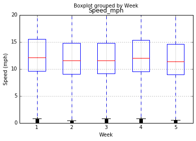


    p-values:
    w1              1              2              3              4              5
    w2                                                                           
    1    1.000000e+00   0.000000e+00   0.000000e+00   2.825930e-28  7.559201e-301
    2    0.000000e+00   1.000000e+00   7.503814e-01  1.027826e-173   7.545484e-19
    3    0.000000e+00   7.503814e-01   1.000000e+00  2.963776e-181   1.500152e-18
    4    2.825930e-28  1.027826e-173  2.963776e-181   1.000000e+00  1.617255e-192
    5   7.559201e-301   7.545484e-19   1.500152e-18  1.617255e-192   1.000000e+00


        - Another interesting question is how the speed changes over the course of the day. In this case I use  one-way anova test on multiple samples. We find that the speed is different in different hours with a zero pvalue of the anova test. The boxplot reveals that traffic is faster early morning and gets really slow in the evening.


```python
# calculate anova
hours = range(24)
cmd = "f_oneway("
for h in hours:
    cmd+="data[data.Hour=="+str(h)+"].Speed_mph,"
cmd=cmd[:-1]+")"
print "one way anova test:", eval(cmd) #evaluate the command and print

# boxplot
data.boxplot('Speed_mph','Hour')
plt.ylim([5,24]) # cut off outliers
plt.ylabel('Speed (mph)')
plt.show()
```

    one way anova test: F_onewayResult(statistic=3385.9731385203672, pvalue=0.0)


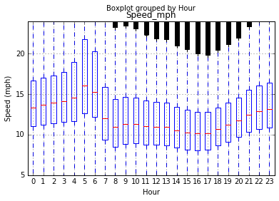


```python

```
